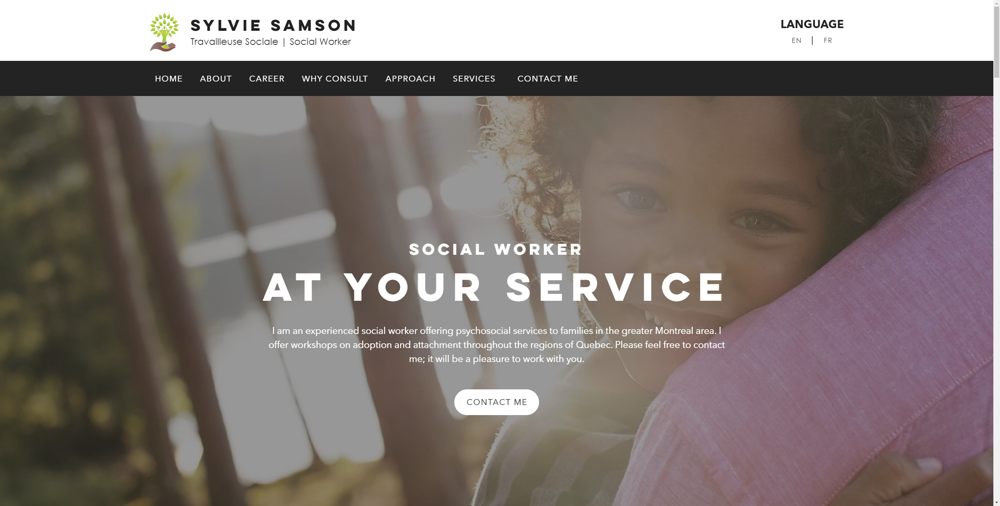

# Client Website

This is Sylvie Samson's Vue.JS-based website. It takes advantage of
Vuetify's components library and run on Netlify.

You can see the build status down below.

[](https://app.netlify.com/sites/sylviesamson/deploys)

## Screenshot



## Project setup
Install all the NPM dependencies
```
npm install
```

### Unlock the .env file
Decrypt the environment variables using the given password
```
npm run unlock [PASSWORD]
```

### Lock the .env file
Encrypt the environment variables using the given password
```
npm run lock [PASSWORD]
```

### Compiles and hot-reloads for development
Run in development mode
```
npm run serve
```

### Compiles and minifies for production
Compile for production mode
```
npm run build
```

### Lints and fixes files
Attempt to auto-format all the files
```
npm run lint
```
